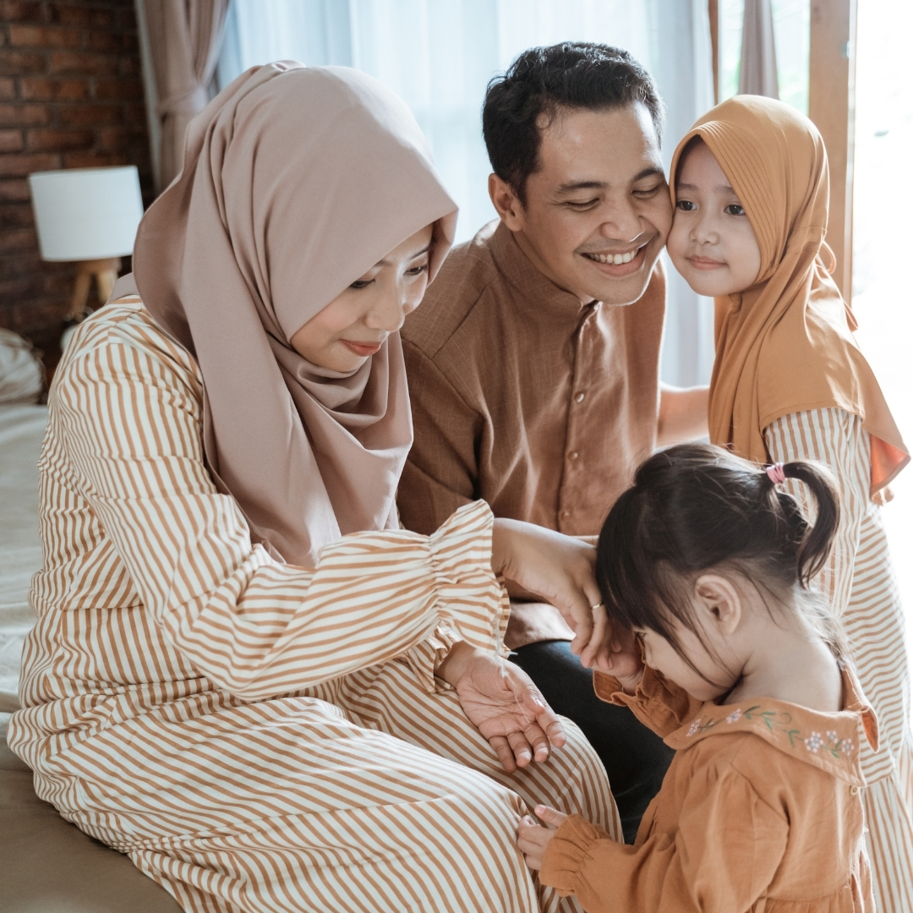

# Al-Aman Website — v4

Bilingual (EN + BM) multi-page static site with photo frames prepared for warm imagery.

## What's new in v4

- **Home hero:** verse card replaced with a **photo frame + small verse overlay** in the bottom-right corner
- **About "Our Story":** promise-quote emerald box replaced with a **story photo frame**, promise quote moved to a pullquote below the paragraphs
- **Copy cuts:** Services (Wasiat + Hibah bodies) and About (GAT + Shariah Panel bodies) rewritten to feel warmer and less formal
- All changes applied to **both EN and BM** pages

## File structure

```
al-aman-website/
├── index.html         (EN Home — with hero photo frame)
├── about.html         (EN About — with story photo frame)
├── services.html      (EN Services — with warmer copy)
├── education.html
├── contact.html
├── styles.css
├── logo-dark.png
├── logo-light.png
├── ms/
│   ├── index.html     (BM Home — with hero photo frame)
│   ├── about.html     (BM About — with story photo frame)
│   ├── services.html  (BM Services — with warmer copy)
│   ├── education.html
│   └── contact.html
└── README.md
```

## How to slot in your photos (step-by-step)

Right now, the site shows dashed-outline placeholder boxes where your photos will go. Each placeholder describes exactly what photo it needs, its aspect ratio, and its focal-point requirements.

### Step 1 — Buy two photos from Getty / Adobe Stock

**Photo 1 — for Home hero**
- Search terms to try:
  - `muslim mother children home candid`
  - `hijab woman family kitchen natural light`
  - `malaysian family lifestyle authentic`
  - `muslim woman writing desk documentary`
- Requirements:
  - **Portrait orientation** (taller than wide, roughly 4:5 or 3:4 aspect)
  - **Focal point should be upper-left** (the subject's face should sit in the top-left area of the frame — because the verse card will overlay the bottom-right corner)
  - Warm natural light, unposed, candid
  - Ideally 1200×1380px or larger

**Photo 2 — for About "Our Story"**
- Search terms to try:
  - `multi generation muslim family hands`
  - `grandmother granddaughter hijab candid`
  - `malaysian family portrait warm`
  - `muslim family embrace natural light`
- Requirements:
  - **Portrait orientation** (roughly 1:1.1 aspect)
  - **Subject centered** (no overlay to worry about)
  - Three generations if possible — grandmother, mother, child — or a hands-focused composition (writing, holding, embracing)
  - Warm natural light, unposed

### Step 2 — Rename the photos

Rename the two files exactly like this before uploading:
- `hero-family.jpg` (for the Home hero)
- `about-story.jpg` (for the About story)

(You can also use `.png` or `.webp` — just make sure the filename matches what you put in the HTML.)

### Step 3 — Upload the photos to your GitHub repo

Drag both files into the **root of your repo** (the same folder where `index.html` and `logo-dark.png` live). Don't put them in the `ms/` folder — the BM pages already reference the root using `../`.

### Step 4 — Edit the HTML to point to your photos

You need to make 4 edits — one on each of these pages. In each case, look for the HTML comment that tells you exactly what to do.

**A) `index.html` (EN Home)**

Find this block (around line 76):

```html
<div class="hero-photo">
  <!-- REPLACE THIS PLACEHOLDER BLOCK WITH:  -->
  <div class="hero-photo-placeholder">
    ... lots of placeholder markup ...
  </div>
</div>
```

Delete the entire `<div class="hero-photo-placeholder"> ... </div>` block and replace with the one-line image tag from the comment:

```html
<div class="hero-photo">
  
</div>
```

**B) `ms/index.html` (BM Home)**

Same block. Delete the placeholder and use:

```html
<div class="hero-photo">
  
</div>
```

⚠️ **Note the `../`** — the BM pages live in `/ms/` so they need to go up one folder to reach the photo in the root.

**C) `about.html` (EN About)**

Find the block around line 65 that starts with `<div class="story-photo-wrap">`. Delete the entire `<div class="story-photo-placeholder"> ... </div>` block and replace with:

```html
<div class="story-photo-wrap">
  
</div>
```

**D) `ms/about.html` (BM About)**

Same block. Delete the placeholder and use:

```html
<div class="story-photo-wrap">
  
</div>
```

### Step 5 — Commit and check

After uploading the two photos and making the four edits, commit the changes on GitHub. Wait ~1 minute for GitHub Pages to rebuild, then hard-refresh your live site (Cmd+Shift+R on Mac). Your photos should now be showing.

## Troubleshooting

**Photo looks stretched or awkwardly cropped:**
- The photo's aspect ratio is too far off from what the frame expects. Home hero wants ~1:1.15 (portrait), About story wants ~1:1.1 (portrait). Try a different photo, or crop yours in Preview/Photoshop before uploading.

**Photo shows in Home but the verse card covers the subject's face:**
- The photo's focal point is centered instead of upper-left. Either crop the photo so the face sits higher/lefter, or choose a different photo.

**Photo doesn't show at all (broken image icon):**
- Check the filename matches exactly, including capitalization. On GitHub Pages, `Hero-Family.jpg` and `hero-family.jpg` are different files.
- Check the path: EN pages use `hero-family.jpg`, BM pages use `../hero-family.jpg`.

**Still stuck:**
- Right-click the broken image, "Open image in new tab" — the URL will show you exactly where the browser is looking. If it's a 404, the photo isn't at that path.

## Still to do

- The Login (`#login`) and Get Started (`#start`) buttons point to anchors — replace with your real platform URLs.
- The contact form shows a client-side success message. Connect it to your email service (Formspree, EmailJS, or a backend).
- Have your Shariah advisory team verify the Quranic verse translations.
- Article link buttons and blog cards currently don't lead anywhere. Wire them up when the individual article pages exist.
